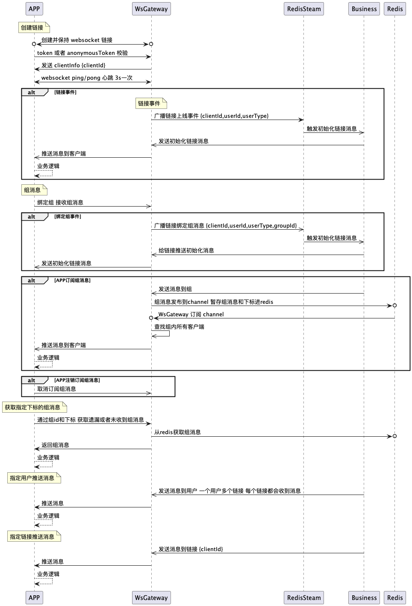

# websocket gateway

a golang websocket gateway

## Features
* horizontal scaling
* single client push
* group push
* client can get miss message
* client can get miss group message
* no ack
* heartbeat text message:ping/Ping/pong/Pong control message: ping/Pong

## Used Packages
* gin github.com/gin-gonic/gin
* gorilla/websocket github.com/gorilla/websocket
* go-redis github.com/go-redis/redis
* cors github.com/gin-contrib/cors
* xid github.com/rs/xid
* concurrent-map https://github.com/orcaman/concurrent-map

## Deployment Example


> nginx/ingress must set proxy-read-timeout and proxy-send-timeout to up to 300s

## Process


## Frontend Example
### vue.js
```javascript
import store from "../store/index";
import {Toast} from "mint-ui";
import WebsocketHeartbeatJs from 'websocket-heartbeat-js';

class myWebsocket extends WebsocketHeartbeatJs {
    lastPingTime = 0;
    pingDelay = 0;

    ondelay(delay) {
    };

    heartReset() {
        if (this.lastPingTime !== 0) {
            this.pingDelay = Date.now() - this.lastPingTime;
            this.ondelay(this.pingDelay)
        }
        super.heartReset();

    }

    heartStart() {
        if (this.forbidReconnect) return;//不再重连就不再执行心跳
        this.pingTimeoutId = setTimeout(() => {
            //这里发送一个心跳，后端收到后，返回一个心跳消息，
            //onmessage拿到返回的心跳就说明连接正常
            this.lastPingTime = Date.now();
            this.ws.send("ping");
            //如果超过一定时间还没重置，说明后端主动断开了
            this.pongTimeoutId = setTimeout(() => {
                //如果onclose会执行reconnect，我们执行ws.close()就行了.如果直接执行reconnect 会触发onclose导致重连两次
                this.ws.close();
            }, this.opts.pongTimeout);
        }, this.opts.pingTimeout);
    }

    heartCheck(event) {
        if (event === "pong") {
            super.heartCheck();
        }
    }

    initEventHandle() {
        this.ws.onclose = (e) => {
            this.onclose(e);
            this.lastPingTime = 0;
            this.reconnect();
        };
        this.ws.onerror = (e) => {
            this.onerror(e);
            this.lastPingTime = 0;
            this.reconnect();
        };
        this.ws.onopen = (e) => {
            this.lastPingTime = Date.now();
            this.repeat = 0;
            this.onopen(e);
            //心跳检测重置
            this.heartCheck("pong");
        };
        this.ws.onmessage = (event) => {
            this.onmessage(event);
            //如果获取到消息，心跳检测重置
            //拿到任何消息都说明当前连接是正常的
            this.heartCheck(event.data);
        };
    }
}

const Socket = {
    toastObj: null,
    lastPingTime: 0,
    init: function (wsUrl) {
        this.conn = new myWebsocket({
            url: wsUrl,
            pingTimeout: 5000,
            pongTimeout: 10000,
        });
        this.conn.onopen = () => {
            if (this.toastObj) {
                this.toastObj.close();
                this.toastObj = null;
            }
            store.dispatch("wsReadyStats", 1);
        }
        this.conn.ondelay = (delay) => {
            console.log(delay)
            store.dispatch("network",delay);
        }
        this.conn.onreconnect = () => {
            if (this.toastObj == null) {
                this.toastObj = Toast({
                    message: "断线重连中...",
                    duration: -1
                });
            }
            store.dispatch("network",999);
            store.dispatch("wsReadyStats", 0);
        }
        this.conn.onerror = () => {
            store.dispatch("wsReadyStats", 0);
        }
        this.conn.onmessage = (evt) => {
            this.message(evt);
        }
        this.conn.onclose = () => {
            store.dispatch("wsReadyStats", 0);
        }
        return this.conn;
    },
    message(evt) {
        if (evt.data !== "Ping" && evt.data !== "Pong" && evt.data !== "pong" && evt.data !== "ping") {
            store.dispatch("receive", evt.data);
        }
    },
    send(message) {
        message = JSON.stringify(message);
        this.conn.send(message);
    },
    close() {
        if (this.conn) {
            this.conn.close();
        }
    },
};

export default {
    Socket,
};
```

### flutter
```dart
import 'dart:convert';
import 'dart:async';
import 'package:websocket_universal/websocket_universal.dart';

class WebSocketManager {
  static WebSocketManager _instance;
  IWebSocketHandler _handler;
  final StreamController<dynamic> _messageController =
      StreamController<dynamic>.broadcast();
  final StreamController<bool> _statusController =
      StreamController<bool>.broadcast();
  final StreamController<dynamic> _networkController =
      StreamController<dynamic>.broadcast();
  String _url;
  int _messageHandler;
  bool _stopMessageHandler;
  int _statusHandler;
  bool _stopStatusHandler;
  int _networkHandler;
  bool _stopNetworkHandler;
  Timer _reconnectTimer;

  WebSocketManager._() {
    _messageHandler = 0;
    _stopMessageHandler = false;
    _statusHandler = 0;
    _stopStatusHandler = false;
    _networkHandler = 0;
    _stopNetworkHandler = false;
  }

  static WebSocketManager get instance {
    _instance ??= WebSocketManager._();
    return _instance;
  }

  void setUrl(String url) {
    _url = url;
  }

  Future<void> connect() async {
    if (_handler?.socketHandlerState?.status == SocketStatus.connected) {
      return;
    }
    if (_handler?.socketHandlerState?.status == SocketStatus.connecting) {
      return;
    }
    IMessageProcessor<String, String> textSocketProcessor =
        SocketSimpleTextProcessor();
    const connectionOptions = SocketConnectionOptions(
      failedReconnectionAttemptsLimit: 99999,
      maxReconnectionAttemptsPerMinute: 100,
      pingIntervalMs: 10000,
      timeoutConnectionMs: 4000,
      // connection fail timeout after 4000 ms
      /// see ping/pong messages in [logEventStream] stream
      skipPingMessages: false,

      /// Set this attribute to `true` if do not need any ping/pong
      /// messages and ping measurement. Default is `false`
      pingRestrictionForce: false,
    );

    /// Example with simple text messages exchanges with server
    /// (not recommended for applications)
    /// [<String, String>] generic types mean that we receive [String] messages
    /// after deserialization and send [String] messages to server.
    _handler = IWebSocketHandler<String, String>.createClient(
      _url, // Postman echo ws server
      textSocketProcessor,
      connectionOptions: connectionOptions,
    );

    // Listening to webSocket status changes
    _handler.socketHandlerStateStream.listen((stateEvent) {
      // print('> status changed to ${stateEvent.status}');
      _statusController.add(stateEvent.status == SocketStatus.connected);
      _networkController
          .add(stateEvent.status == SocketStatus.connected ? '' : 999);
    });

    // Listening to server responses:
    _handler.incomingMessagesStream.listen((inMsg) {
      // print(inMsg);
      _messageController.add(inMsg);
      _networkController.add(_handler.pingDelayMs);
    });

    // Connecting to server:
    final isTextSocketConnected = await _handler.connect();
    if (!isTextSocketConnected) {
      // ignore: avoid_print
      // print('Connection to [$_url] failed for some reason!');
      connect();
      return;
    }
  }

  Future<void> disconnect() async {
    disposeHandler();
    // _handler?.close();
      _handler?.disconnect("logout");

    _statusController.add(false);
    _networkController.add(false);
  }

  send(data) {
    try {
      _handler.sendMessage(jsonEncode(data));
    } catch (e) {
      print("send" + e.toString());
    }
  }

  void handlerMessage(Function doMsg) {
    _messageHandler++;
    _stopMessageHandler = false;
    Future.delayed(const Duration(seconds: 1), () {
      handleMessageStream(messageStream, doMsg, _messageHandler);
    });
  }

  void disposeHandler() {
    _statusHandler++;
    _messageHandler++;
    _networkHandler++;
    _stopStatusHandler = false;
    _stopMessageHandler = false;
    _stopNetworkHandler = false;
  }

  void handlerStatus(Function doStatus) {
    _statusHandler++;
    _stopStatusHandler = false;
    Future.delayed(const Duration(seconds: 1), () {
      handleStatusStream(statusStream, doStatus, _statusHandler);
    });
  }

  void handlerNetwork(Function doNetwork) {
    _networkHandler++;
    _stopNetworkHandler = false;
    Future.delayed(const Duration(seconds: 1), () {
      handleNetworkStream(networkStream, doNetwork, _networkHandler);
    });
  }

  Future<void> handleMessageStream(
      Stream stream, Function doSo, int index) async {
    _stopMessageHandler = true;
    while (_stopMessageHandler) {
      try {
        await for (final event in stream) {
          if (_stopMessageHandler && index == _messageHandler) {
            await doSo(event);
          } else {
            break;
          }
        }
      } catch (e) {
        print(e);
      }
    }
  }

  Future<void> handleNetworkStream(
      Stream stream, Function doSo, int index) async {
    _stopNetworkHandler = true;

    while (_stopNetworkHandler) {
      try {
        await for (final event in stream) {
          if (_stopNetworkHandler && index == _networkHandler) {
            await doSo(event);
          } else {
            break;
          }
        }
      } catch (e) {
        print(e.toString());
      }
    }
  }

  Future<void> handleStatusStream(
      Stream stream, Function doSo, int index) async {
    _stopStatusHandler = true;
    while (_stopStatusHandler) {
      try {
        await for (final event in stream) {
          if (_stopStatusHandler && index == _statusHandler) {
            await doSo(event);
          } else {
            break;
          }
        }
      } catch (e) {
        print(e);
      }
    }
  }

  Stream<dynamic> get messageStream => _messageController.stream;

  Stream<bool> get statusStream => _statusController.stream;

  Stream<dynamic> get networkStream => _networkController.stream;
}
```